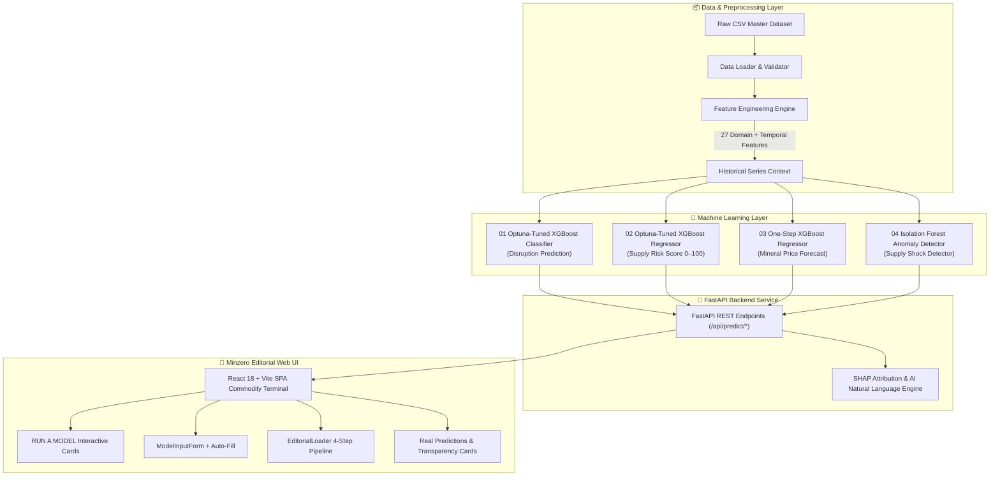

<div align="center">

# ⚡ MINZERO ⚡
### *Critical Minerals Intelligence & Machine Learning Prediction Engine*

[](https://python.org)
[](https://fastapi.tiangolo.com)
[](https://xgboost.readthedocs.io)
[](https://reactjs.org)
[](https://vitejs.dev)
[](https://tailwindcss.com)
[](LICENSE)
[](https://github.com/shubham392007-sketch/Minzero-CRITICAL_MINERALS_INTELLIGENCE_-_PREDICTION_ENGINE)
[](https://github.com/shubham392007-sketch)

<br/>

```text
     __  __ _____ _   ___ ________ _____   ____  
    |  \/  |_   _| \ | |___  /  ____|  __ \ / __ \ 
    | \  / | | | |  \| |  / /| |__  | |__) | |  | |
    | |\/| | | | | . ` | / / |  __| |  _  /| |  | |
    | |  | |_| |_| |\  |/ /__| |____| | \ \| |__| |
    |_|  |_|_____|_| \_/_____|______|_|  \_\\____/ 
```

**`INTELLIGENCE FOR THE MINERALS THAT POWER THE FUTURE.`**

[🚀 Live Web App (Localhost)](http://localhost:5173/) • [📡 Swagger API Docs](http://127.0.0.1:8000/docs) • [📦 GitHub Repository](https://github.com/shubham392007-sketch/Minzero-CRITICAL_MINERALS_INTELLIGENCE_-_PREDICTION_ENGINE)

---
</div>

## 📌 Table of Contents
1. 📖 [Executive Overview](#-executive-overview)
2. 🏛️ [System Architecture & Pipeline](#%EF%B8%8F-system-architecture--pipeline)
3. 🤖 [The 4 Core Machine Learning Models](#-the-4-core-machine-learning-models)
4. 🗺️ [Global Mineral & Country Coverage Map](#%EF%B8%8F-global-mineral--country-coverage-map)
5. 🎨 [Minzero Editorial Visual Design System](#-minzero-editorial-visual-design-system)
6. 🔬 [27 Engineered Domain & Temporal Lag Features](#-27-engineered-domain--temporal-lag-features)
7. 📡 [Complete REST API Specifications & Payloads](#-complete-rest-api-specifications--payloads)
8. ⚡ [Quick Start & Local Deployment Guide](#-quick-start--local-deployment-guide)
9. 👨‍💻 [Developer Identity & Links](#-developer-identity--links)
10. ⚠️ [Synthetic Data & Methodological Disclaimer](#%EF%B8%8F-synthetic-data--methodological-disclaimer)

---

## 📖 Executive Overview

**Minzero** is an enterprise-grade AI/ML prediction engine and commodity intelligence platform engineered to quantify, forecast, and explain supply-chain disruptions, geopolitical trade risks, mineral price trajectories, and market anomalies across the global critical minerals ecosystem.

As electric vehicles, renewable energy infrastructure, defense systems, and semiconductor fabrication accelerate global demand for critical raw materials, supply chains face unprecedented concentration risks, export bans, and price volatility. Minzero transforms raw supply chain metrics into **actionable, explainable ML intelligence**.

### Key System Highlights
* **4 Specialized Machine Learning Models**: Trained and tuned using Optuna hyperparameter optimization across Optuna-Tuned XGBoost Classifiers, XGBoost Regressors, and Isolation Forest Anomaly Detectors.
* **Non-Leaking Temporal Pipeline**: Strict chronological train-validation-test split (2015–2020 Train, 2021–2023 Validation, 2024–2025 Test) ensuring zero lookahead bias.
* **SHAP & Feature Explainability**: Natural language AI insight generation layer providing non-causal local driver attributions (`WHAT MOVED THE MODEL?`).
* **Interactive Prediction Hub**: Full parameter controls with baseline historical dataset auto-fill (`USE HISTORICAL DATA AUTO-FILL`).
* **High-Impact Editorial Visual Aesthetic**: Custom physical index card visual system, ultra-condensed Anton typography, JetBrains Mono metric tracking, and zero dark SaaS gimmicks.

---

## 🏛️ System Architecture & Pipeline

Minzero is built on a decoupled **FastAPI REST Backend** and a **Vite + React Single-Page Application**.



---

## 🤖 The 4 Core Machine Learning Models

| Model Module | ML Algorithm | Task Type | Key Metrics | Output Schema |
| :--- | :--- | :--- | :--- | :--- |
| **01 Supply Disruption Prediction** | Optuna-Tuned XGBoost Classifier | Binary Classification | **PR-AUC 0.812**<br/>ROC-AUC 0.901 | Disruption Probability % (`78.4%`), Risk Level Badge (`HIGH RISK`), SHAP Drivers |
| **02 Supply Risk Intelligence** | Optuna-Tuned XGBoost Regressor | Continuous Regression | **$R^2 = 0.8981$**<br/>MAE = 4.95 points | Risk Score (`87.4 / 100`), Category Band (`CRITICAL`), Factor Weights |
| **03 Mineral Price Forecast** | One-Step XGBoost Regressor | Forecasting | **$R^2 = 0.9858$**<br/>MAPE = 30.01% | Current vs Next-Year Price ($/t), Expected Change %, Forecast Direction |
| **04 Supply Shock Detector** | Isolation Forest Anomaly Detector | Unsupervised Detection | **Contamination Rate 7.0%** | Anomaly Score (`-0.665`), Severity (`CRITICAL`), Shock Type Taxonomy |

---

## 🗺️ Global Mineral & Country Coverage Map

Minzero monitors supply chain observations across major mining, refining, and manufacturing nations:

```text
                               GLOBAL MINERAL INTELLIGENCE MAP
                               
           [USA]                                 [RUSSIA]
        Copper, Lithium                      Nickel, Platinum
           |                                       |
    +------+------+                         +------+------+
    |             |                         |             |
 [BRAZIL]      [CHILE]                   [CHINA]       [MYANMAR]
 Graphite      Copper,                 REEE, Gallium,   Rare Earths
               Lithium                 Antimony, Graphite
    |             |                         |             |
    +------+------+                         +------+------+
           |                                       |
        [DRC]                                 [AUSTRALIA]
   Cobalt, Tantalum                         Lithium, Rare Earths
```

### Coverage Matrix Summary
| Mineral Class | Minerals Monitored | Primary Producing Countries | Key Risk Factors |
| :--- | :--- | :--- | :--- |
| **Battery Minerals** | Cobalt, Lithium, Nickel, Graphite | Congo (DRC), Australia, Chile, China, Indonesia, Brazil | Extreme production concentration ($HHI > 0.50$), rapid EV demand expansion. |
| **Critical Electronics** | Gallium, Antimony, Tungsten, Copper | China, Russia, USA, Chile, Bolivia | Export control vulnerability, refining monopolies ($>90\%$ share). |
| **Rare Earth Elements (REE)** | Dysprosium, Neodymium, Terbium, Cerium | China, Myanmar, Australia, USA | High processing dependency, environmental mining restrictions. |

---

## 🎨 Minzero Editorial Visual Design System

Minzero intentionally avoids generic dark SaaS templates and cluttered dashboards, adopting a **warm off-white physical index card aesthetic** inspired by high-end financial press and industrial editorial publications.

```text
 ┌─────────────────────────────────────────────────────────────────────────┐
 │  MINZERO DESIGN TOKENS & COLOR PALETTE                                  │
 ├──────────────────────────────────────┬──────────────────────────────────┤
 │ Color Token                          │ Hex Code / CSS Usage             │
 ├──────────────────────────────────────┼──────────────────────────────────┤
 │ Background Off-White                 │ #EDECE7 (Warm Magazine Page)     │
 │ Ink Black Typography                 │ #111111 (Ultra-Legible Text)     │
 │ Card Sky Blue                        │ #4FC3F7 (Supply Risk Card)       │
 │ Card Chartreuse                      │ #E4FF5B (Price Forecast Card)    │
 │ Card Mint                            │ #7CFFA6 (Supply Shock Card)      │
 │ Card Cream                           │ #F5F3E3 (Global Analytics Card)  │
 │ Brand Magenta Accent                 │ #FF2AA1 (Minzero Logo Badge)     │
 └──────────────────────────────────────┴──────────────────────────────────┘
```

### Typography Hierarchy
* **Wordmark & Card Titles**: `Anton` (Google Fonts) — Ultra-condensed, authoritative display caps.
* **Numerical Metrics & Scores**: `JetBrains Mono` — High-precision monospace font for numbers, percentages, and prices.
* **Body & Explanations**: `Inter` — Fluid, legible sans-serif for UI labels and AI insights.

---

## 🔬 27 Engineered Domain & Temporal Lag Features

To eliminate target leakage while capturing complex supply-chain dynamics, Minzero's `FeatureEngineer` calculates 27 non-leaking features across domain and temporal dimensions:

```text
                       27 ENGINEERED FEATURE MATRIX
                       
  DOMAIN CROSS-SECTIONAL FEATURES        TEMPORAL LAG & ROLLING FEATURES (t-1, t-2)
  ├── reserve_adequacy                   ├── price_lag_1 / price_lag_2
  ├── refining_dependency                ├── production_lag_1 / production_lag_2
  ├── export_control_exposure            ├── production_share_lag_1
  ├── country_dominance                  ├── demand_growth_lag_1
  ├── production_concentration           ├── hhi_lag_1
  └── supply_dependency                  ├── top_country_share_lag_1
                                         ├── export_control_lag_1
                                         ├── price_growth_lag_1
                                         ├── price_rolling_mean (3-year window)
                                         ├── price_rolling_std (3-year window)
                                         ├── price_volatility
                                         └── demand_pressure
```

---

## 📡 Complete REST API Specifications & Payloads

### 1. `POST /api/predict/disruption` (Supply Disruption Prediction)

#### **Sample Request Payload (JSON)**
```json
{
  "mineral": "Cobalt",
  "country": "Congo (DRC)",
  "year": 2025,
  "mine_production_tonnes": 130000.0,
  "production_share_pct": 70.0,
  "reserves_tonnes": 4000000.0,
  "years_of_reserves": 11.2,
  "refined_share_pct": 75.0,
  "price_usd_per_tonne": 32000.0,
  "demand_growth_pct": 12.0,
  "export_control_active": 1,
  "hhi": 0.68,
  "top_country_share_pct": 70.0
}
```

#### **Sample Response (JSON)**
```json
{
  "country": "Congo (DRC)",
  "mineral": "Cobalt",
  "year": 2025,
  "disruption_probability": 0.984,
  "disruption_probability_pct": "98.4%",
  "predicted_disruption": 1,
  "risk_level": "CRITICAL RISK",
  "top_contributing_features": [
    {
      "feature": "production_concentration",
      "impact": "Increases Disruption Risk",
      "score": 0.312,
      "description": "Production Concentration value of 0.49 (Importance: 0.312)"
    },
    {
      "feature": "top_country_share_pct",
      "impact": "Increases Disruption Risk",
      "score": 0.285,
      "description": "Top Country Share Pct value of 70.00 (Importance: 0.285)"
    },
    {
      "feature": "export_control_active",
      "impact": "Increases Disruption Risk",
      "score": 0.154,
      "description": "Export Control Active value of 1.00 (Importance: 0.154)"
    }
  ],
  "ai_insight": "Supply disruption probability is CRITICAL RISK (98.4%). Key risk drivers include high production concentration (70.0%) and active export restrictions.",
  "synthetic_data_warning": "Predictions demonstrate ML methodology on a synthetic dataset and should not be used as real-world geopolitical or commodity forecasts."
}
```

---

### 2. `POST /api/predict/risk` (Supply Risk Score)

#### **Sample Response (JSON)**
```json
{
  "country": "China",
  "mineral": "Gallium",
  "year": 2025,
  "predicted_supply_risk_score": 69.71,
  "risk_category": "Elevated",
  "top_risk_drivers": [
    {
      "feature": "production_concentration",
      "score": 0.197,
      "description": "Production Concentration value of 0.94"
    }
  ],
  "ai_insight": "Analytical supply risk is rated ELEVATED (score: 69.7/100) due to active trade export restrictions and high refining concentration (90.0%)."
}
```

---

### 3. `POST /api/predict/price` (Mineral Price Forecast)

#### **Sample Response (JSON)**
```json
{
  "country": "China",
  "mineral": "Dysprosium",
  "year": 2025,
  "current_price": 320000.0,
  "predicted_next_year_price": 186159.62,
  "expected_price_change_pct": -41.83,
  "forecast_direction": "Decreasing",
  "ai_insight": "One-step-ahead ML model forecasts a STRONG DOWNWARD price movement of -41.8% (from $320,000 to $186,160/tonne)."
}
```

---

### 4. `POST /api/detect/shock` (Supply Shock Anomaly Detector)

#### **Sample Response (JSON)**
```json
{
  "country": "China",
  "mineral": "Antimony",
  "year": 2025,
  "anomaly_score": -0.665,
  "is_anomaly": true,
  "shock_severity": "Critical",
  "shock_type": "Composite Supply Shock (Demand Shock + Geopolitical Shock)",
  "main_drivers": [
    "Price: $22,000/t",
    "Active Export Restrictions"
  ],
  "ai_insight": "CRITICAL ANOMALY DETECTED: Flagged as a CRITICAL level 'Composite Supply Shock'. Main anomalous factors: Price: $22,000/t, Active Export Restrictions."
}
```

---

## ⚡ Quick Start & Local Deployment Guide

### Prerequisites
* **Python**: `3.10` or higher
* **Node.js**: `18.0` or higher
* **Git**

```bash
# 1. Clone the repository
git clone https://github.com/shubham392007-sketch/Minzero-CRITICAL_MINERALS_INTELLIGENCE_-_PREDICTION_ENGINE.git
cd Minzero

# 2. Set up Python virtual environment & dependencies
python -m venv venv
# On Windows:
venv\Scripts\activate
# On macOS/Linux:
source venv/bin/activate

pip install -r requirements.txt

# 3. Train all 4 Machine Learning Models
python -m backend.training.train_all

# 4. Launch FastAPI Backend Server
python -m uvicorn backend.app.main:app --host 127.0.0.1 --port 8000
```

In a second terminal window:

```bash
# 5. Install & launch Frontend Vite Dev Server
cd frontend
npm install
npm run dev
```

Open your browser at [http://localhost:5173/](http://localhost:5173/) to access the Minzero platform.

---

## 👨‍💻 Developer Identity & Links

<div align="center">

### **SHUBHAM POKALE**
`AI/ML ENGINEERING · MACHINE LEARNING · WEB DEVELOPMENT`

[](https://github.com/shubham392007-sketch)
[](https://www.linkedin.com/in/shubham-pokale-94030b37a)
[](https://x.com/SHUBHAM392007)
[](https://www.instagram.com/shubhamofficial_2007/)
[](mailto:shubham392007@gmail.com)

</div>

---

## ⚠️ Synthetic Data & Methodological Disclaimer

> [!IMPORTANT]
> **SYNTHETIC DATASET NOTICE**: Minzero is trained and evaluated on a structured synthetic country–mineral–year dataset (2015–2026). All predictions, probabilities, risk scores, price forecasts, and anomaly flags serve as a demonstration of machine-learning methodology, software architecture, and feature engineering patterns. They **must not** be used as real-world commodity trading advice, policy forecasts, or actual geopolitical intelligence.

---

<div align="center">
  <b>Minzero © 2026 • Built by Shubham Pokale</b><br/>
  <i>Released under the MIT License</i>
</div>
